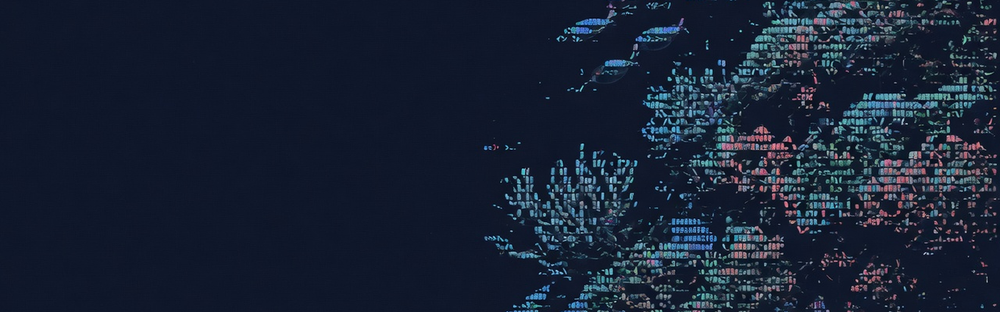

<p align="center">
  
</p>

# Omarchy Barrier Reef Theme

An Omarchy theme for dark terminals and deep water. Barrier Reef sits on near-black navy. Coral light and blue shoals mark the rest.

## Install

```sh
omarchy-theme-install https://github.com/csfh/omarchy-barrier-reef-theme
```

You can also install it from the Omarchy menu with `Super + Alt + Space`, then `Install > Style > Theme`, using this repository URL:

```text
https://github.com/csfh/omarchy-barrier-reef-theme
```

## Palette

| Role | Hex |
| --- | --- |
| Background | `#030309` |
| Foreground | `#dce5f6` |
| Accent | `#75a8ff` |
| Red | `#e3928b` |
| Green | `#9cca8a` |
| Yellow | `#ffa7a4` |
| Magenta | `#9facf1` |
| Cyan | `#65c4ff` |

## Included

Desktop, terminal, editor, launcher, notification, bar, lock screen, browser, Discord, and TUI theme files for Omarchy:

`alacritty`, `btop`, `chromium`, `foot`, `ghostty`, `gtk`, `hyprland`, `hyprlock`, `kitty`, `mako`, `neovim`, `swayosd`, `vencord`, `vscode`, `walker`, `warp`, `waybar`, `wofi`, and `zellij`.

## Backgrounds

The wallpapers are photographs on [Unsplash](https://unsplash.com), used under the [Unsplash License](https://unsplash.com/license):

- [`violet-garden`](backgrounds/violet-garden.jpg) by [Giulia Salvaterra](https://unsplash.com/photos/a-fish-swimming-in-an-aquarium-EW9z19sPiZc)
- [`reef-canopy`](backgrounds/reef-canopy.jpg) by [NEOM](https://unsplash.com/@neom) ([photo](https://unsplash.com/photos/an-underwater-view-of-a-colorful-coral-reef-HYHYGLs-Rp8))
- [`clown-anemone`](backgrounds/clown-anemone.jpg) by [Giorgia Doglioni](https://unsplash.com/photos/clown-fish-on-coral-reef-vZsg8M_lZNY)

## License

MIT. See [LICENSE](LICENSE). Copyright (c) 2026 Christoffer Hallas.

Unsplash photographs remain the work of their authors under the Unsplash License.

If you send a pull request or other contribution, you agree to the [CLA](CLA.md).
